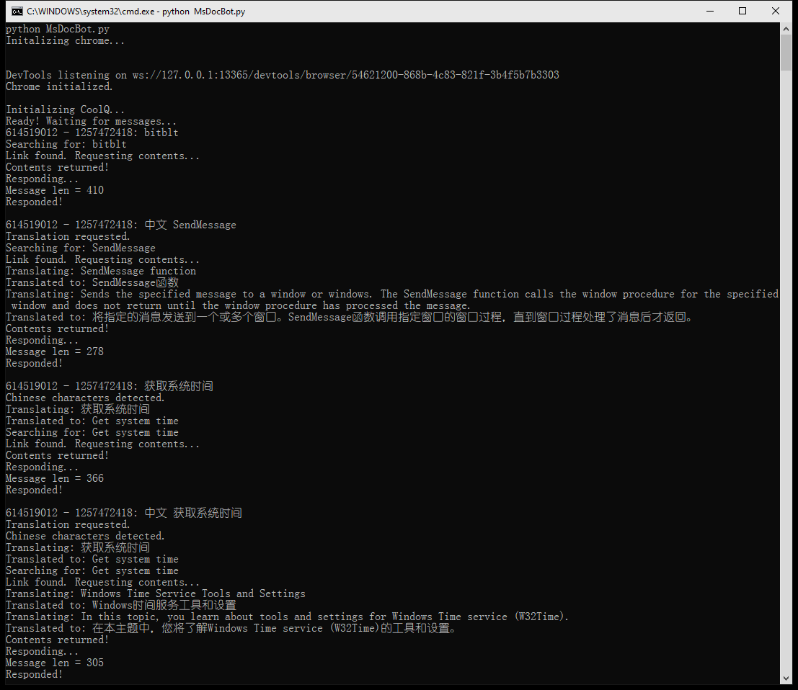
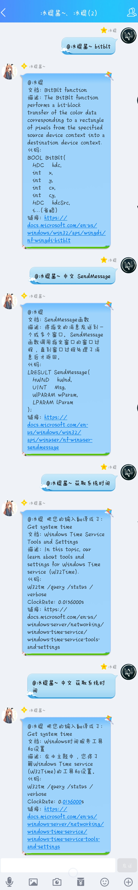

# QQ_MsDoc_Bot
从微软官方文档里搜索资料的QQ聊天机器人

# 功能
1. 根据消息自动搜索相关内容，拉取第一条链接，模拟点击进入，并通过获取页面元素的方式抽取标题、描述、代码片段等信息。
2. 若消息以“中文”开头，例如“中文 SendMessage”，该程序会使用有道翻译API把拉取道德页面标题和描述翻译成中文。
3. 若消息里面包含中文字符，该程序会先使用有道翻译API把消息翻译成英文然后再进行搜索。

# 准备
1. 安装酷Q和酷Q的HTTP API插件
2. 安装依赖的python库
3. 安装ChromeDriver (WebDriver for Chrome)
4. 把YoudaoTranslateAPI.py里面有关的key替换成您的key以使用中英文翻译功能

# 效果

 控制台界面  

 聊天界面  

# 啰嗦话
这是我第二次尝试弄QQ机器人，以及第一次尝试用python通过webdriver解析网页信息。也挺有意义的 :)

自感觉这次比第一次写的聊天机器人进步不少，代码也好看了一点。

本来想弄成把目标网页截图然后发送截图的方式，但是酷Q Pro才能发图，故放弃。

发现本程序有时候会发送消息失败，暂不明白原因。猜测是消息长度太长导致的（但是有时候短消息也会发送失败）。暂时没有找到好的解决方法。目前的解决方法是把消息长度限制在415字以内（这个数字是经过多次尝试得出的），但是仍然有一定几率消息发送失败。

非常感谢亲爱的阳光加冰把他的有道词典API key给我用来测试~ 爱你哦 （づ￣3￣）づ╭❤～
